# 🎥 Enterprise OTT Platform

  

A scalable, full-stack **Over-The-Top (OTT) Media Platform** designed for high-performance content delivery. This monorepo architecture integrates a headless CMS for content management, a robust REST API for data serving, and an automated background worker for scheduled publishing.

## ✨ Key Features

-   **Headless CMS**: Next.js-based dashboard for intuitive content management.
-   **Role-Based Access Control (RBAC)**: secure Admin and Editor roles with granular permissions.
-   **Automated Publishing**: Background workers handle scheduled content release without manual intervention.
-   **Multi-Language Support**: Native support for primary and auxiliary content languages.
-   **Asset Management**: Structured handling of thumbnails, posters, and video URLs across variants (Landscape/Portrait).
-   **Scalable Architecture**: Dockerized microservices ready for cloud deployment.

---

## 🛠 Technology Stack

| Component | technologies | Description |
| :--- | :--- | :--- |
| **Frontend (CMS)** |   | React-based dashboard with server-side rendering. |
| **Backend API** |   | Modular architecture using NestJS for business logic. |
| **Database** |   | Relational data model with type-safe ORM access. |
| **DevOps** |   | Containerized environment for consistent deployment. |

---

## 🏗 Architecture Overview

The system follows a microservices-inspired monolithic structure (Monorepo) managed by NPM workspaces.

### 1. System Diagram

```mermaid
graph TD
    UserClient[📱 End User Apps] -->|REST API| API
    Admin[👨‍💻 Content Editor] -->|HTTPS| CMS
    
    subgraph "OTT Platform Infrastructure"
        direction TB
        CMS[🖥️ CMS Dashboard] -->|Manage Content| API[⚙️ Backend API Service]
        API -->|Read/Write| DB[(🐘 Postgres Database)]
        Worker[🤖 Background Worker] -->|Poll Schedule| DB
    end

    style CMS fill:#eff,stroke:#333,stroke-width:2px
    style API fill:#ffe,stroke:#333,stroke-width:2px
    style Worker fill:#fef,stroke:#333,stroke-width:2px
    style DB fill:#eee,stroke:#333,stroke-width:2px
```



### 2. Publishing Workflow (Sequence Diagram)

This diagram illustrates how content moves from Draft to Published state automatically.


### 3. Project Structure

```bash
OTT_app-main/
├── packages/
│   ├── api/          # NestJS Backend Application
│   │   ├── src/      # Controllers, Services, Modules
│   │   └── prisma/   # Database Schema & Seeds
│   ├── cms/          # Next.js Frontend Application
│   │   ├── app/      # Pages & Routing
│   │   └── lib/      # API Clients & Utilities
│   └── worker/       # Node.js Background Service
│       └── src/      # Cron Jobs & Business Logic
├── docker-compose.yml # Local development orchestration
└── README.md         # Project documentation
```

---

## 🚀 Local Setup Guide

Follow these steps to get the entire platform running on your local machine.

### Prerequisites
-   **Node.js**: v18 or higher
-   **Docker**: Desktop version installed and running

### Step 1: Start the Database
Spin up the PostgreSQL instance using Docker.
```powershell
docker run -d --name ott-postgres -e POSTGRES_DB=ott_cms -e POSTGRES_USER=postgres -e POSTGRES_PASSWORD=postgres -p 5432:5432 postgres:15-alpine
```

### Step 2: Install Dependencies
Install packages for all workspaces from the root.
```powershell
npm install
```

### Step 3: Initialize Database
Generate the Prisma client and push the schema to your local DB.
```powershell
cd packages/api
npx prisma generate
npx prisma db push
```

### Step 4: Seed Initial Data
Populate the database with default users (Admin/Editor) and sample content categories.
```powershell
npx tsx prisma/seed.ts
```

### Step 5: Start the Services
You will need to run **three separate terminal windows** to keep all services active.

**Terminal 1: Backend API**
```powershell
cd packages/api
npm run start:dev
```
*Runs on: `http://localhost:3000`*

**Terminal 2: CMS Dashboard**
```powershell
cd packages/cms
npm run dev
```
*Runs on: `http://localhost:3001`*

**Terminal 3: Background Worker**
```powershell
cd packages/worker
npm run dev
```
*Logs scheduled tasks every minute.*

---

## 🔐 Credentials & Access

Use these default credentials to log in to the local CMS.

| Role | Email | Password | Permissions |
| :--- | :--- | :--- | :--- |
| **Admin** | `admin@chaishorts.com` | `admin123` | Full Access (Users, Settings, Content) |
| **Editor** | `editor@chaishorts.com` | `editor123` | Content Management Only |

---

## 🌐 Deployed Environments

| Service | URL |
| :--- | :--- |
| **CMS Dashboard** | [https://ott-application-cms.vercel.app/](https://ott-application-cms.vercel.app/) |
| **API Endpoint** | [https://ott-application.onrender.com/api](https://ott-application.onrender.com/api) |
| **API Docs** | [https://ott-application.onrender.com/api/docs](https://ott-application.onrender.com/api/docs) |

---

## 🎬 Demo Scenario: Scheduled Publishing

To verify the robust background worker architecture, follow this test flow:

1.  **Login to the CMS** (`http://localhost:3001`) as **Admin**.
2.  **Navigate to Programs** and create a new dummy Program (e.g., "Tech Talk 2024").
3.  **Add a Term** (Season 1) and a **Lesson** (Episode 1).
4.  **Set Publish Date**: In the lesson details, set the 'Publish At' time to **2 minutes in the future**.
5.  **Save**: Observe the status is `SCHEDULED` (Yellow).
6.  **Switch to Terminal 3 (Worker)**: Watch the logs.
    -   *Minute 0*: "Monitoring for scheduled lessons..."
    -   *Minute 2*: "Published lesson: [UUID]"
7.  **Refresh CMS**: The lesson status will automatically change to `PUBLISHED` (Green).

---

## 📦 Database Management

Common commands for managing the database during development.

**Run Migrations** (after changing `schema.prisma`)
```powershell
npx prisma db push
```

**Reset Data** (Clear DB and re-seed)
```powershell
npx tsx prisma/seed.ts
```

**Open Database GUI**
```powershell
npx prisma studio
```
*Opens at `http://localhost:5555`*